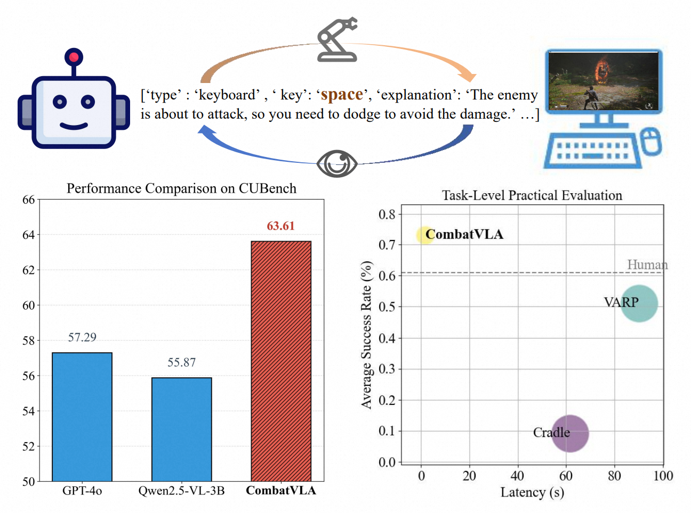
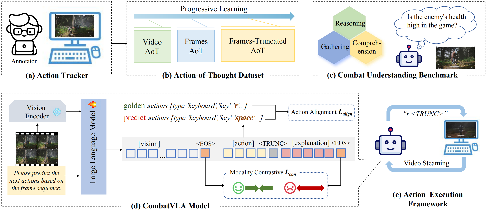

# CombatVLA: An Efficient Vision-Language-Action Model for Combat Tasks in 3D Action Role-Playing Games
> 
> Peng Chen*, Pi Bu*, Yingyao Wang, Xinyi Wang, Ziming Wang, Jie Guo, Yingxiu Zhao, Qi Zhu, Jun Song $^\dagger$, Siran Yang, Jiamang Wang, Bo Zheng
> 
> ICCV 2025 Main Conference Paper  
> [[Project](https://combatvla.github.io/)] / [[Paper](https://arxiv.org/abs/2503.09527)]  

<div style="text-align: center;">
  
</div>
CombatVLA surpasses GPT-4o and Qwen2.5-VL in combat understanding, is 50 times faster than Cradle and VARP framework, and has a higher success rate than humans.

## News

- **[2025/06/26]** CombatVLA is accepted by ICCV 2025!

## Overview



Recent advances in Vision-Language-Action models (VLAs) have expanded the capabilities of embodied intelligence. However, significant challenges remain in real-time decision-making in complex 3D environments, which demand second-level responses, high-resolution perception, and tactical reasoning under dynamic conditions. To advance the field, we introduce CombatVLA, an efficient VLA model optimized for combat tasks in 3D action role-playing games(ARPGs). Specifically, our CombatVLA is a 3B model trained on video-action pairs collected by an action tracker, where the data is formatted as action-of-thought (AoT) sequences. Thereafter, CombatVLA seamlessly integrates into an action execution framework, allowing efficient inference through our truncated AoT strategy. Experimental results demonstrate that CombatVLA not only outperforms all existing models on the combat understanding benchmark but also achieves a 50-fold acceleration in game combat. Moreover, it has a higher task success rate than human players. We will open-source all resources, including the action tracker, dataset, benchmark, model weights, training code, and the implementation of the framework.

## Citation

If you find this project helpful, please consider citing the our paper:
```
@article{chen2025combatvla,
  title={CombatVLA: An Efficient Vision-Language-Action Model for Combat Tasks in 3D Action Role-Playing Games
  author={Chen, Peng and Bu, Pi and Wang, Yingyao and Wang, Xinyi and Wang, Ziming and Guo, Jie and Zhao, Yingxiu and Zhu, Qi and Song, Jun and Yang, Siran and Wang, Jiaming and Zheng, Bo},
  booktitle={Proceedings of the International Conference on Computer Vision, ICCV 2025},
  year={2025}
}
```
